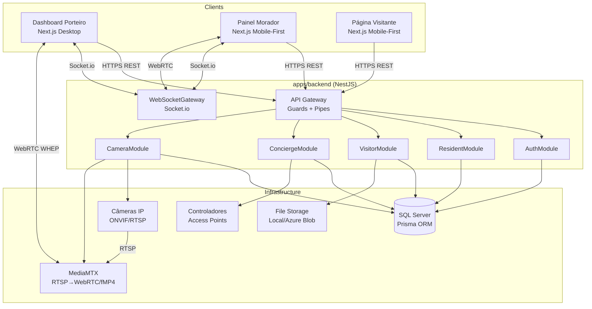
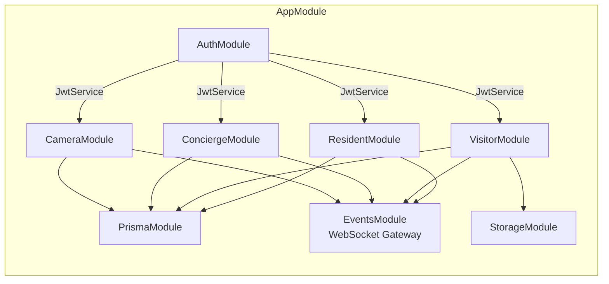
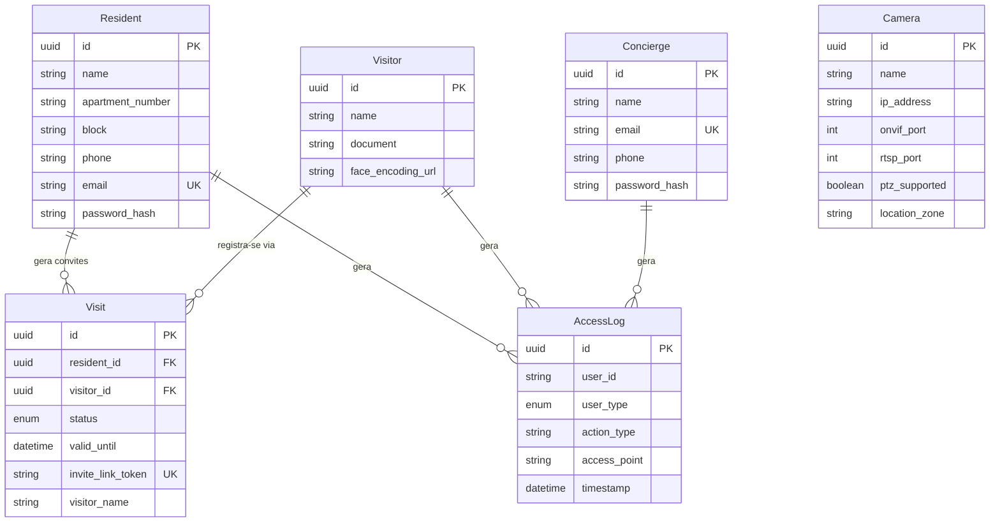
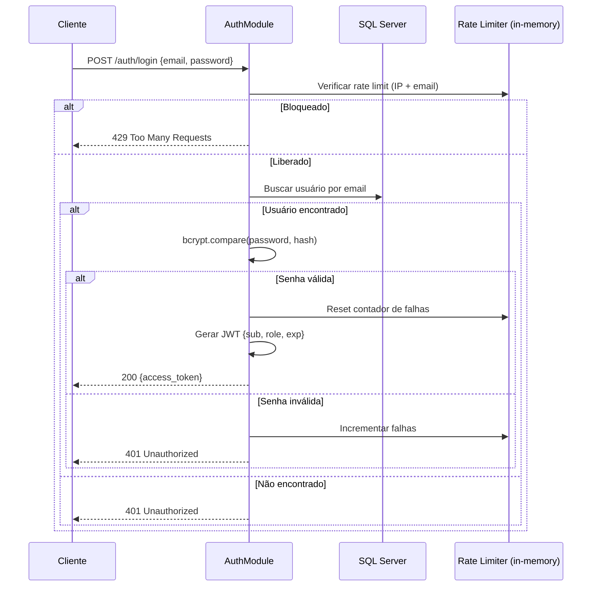
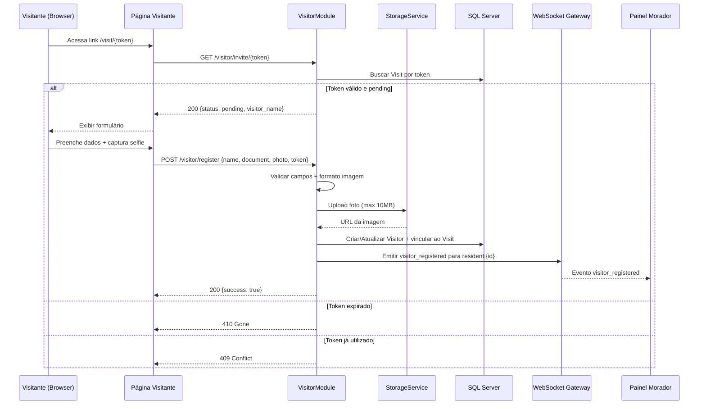
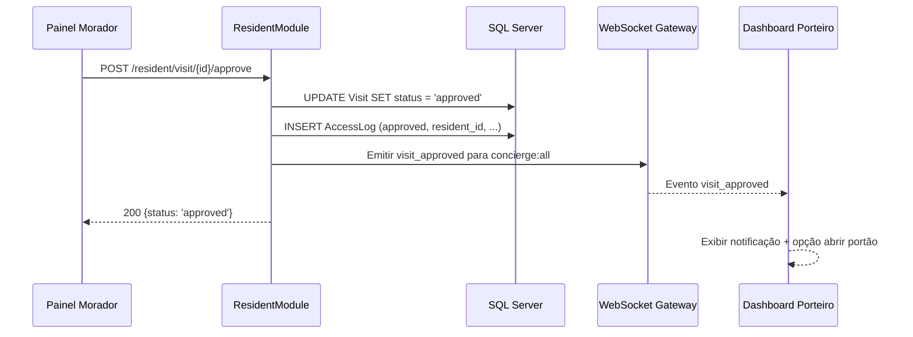
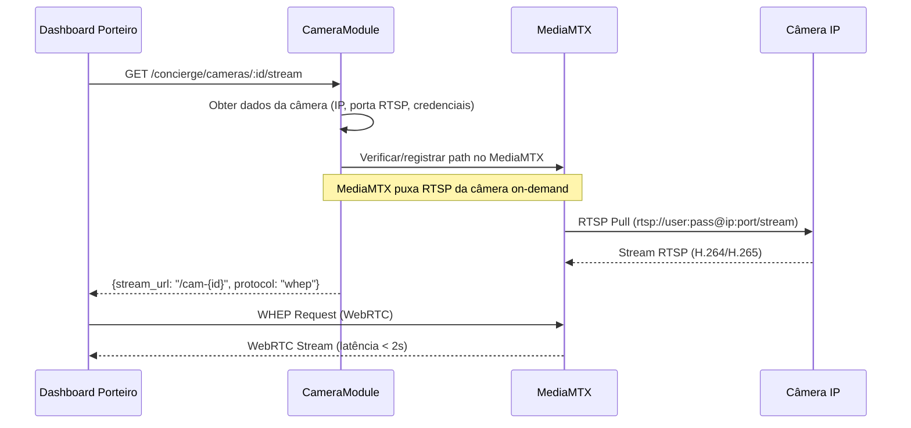

# Design Document — INFOSEG CORE: Portaria Remota de Condomínios

## Overview

O INFOSEG CORE é um sistema full-stack de portaria remota para condomínios, composto por três interfaces web (Dashboard do Porteiro, Painel do Morador e Página do Visitante) e uma camada de back-end construída como monorepo TypeScript.

**Objetivos de design:**
- Tempo real como cidadão de primeira classe (Socket.io para eventos, WebRTC para áudio/vídeo)
- Streaming de câmeras com latência < 2s usando MediaMTX como gateway RTSP→WebRTC/fMP4
- Segurança em profundidade (JWT, bcrypt, rate limiting, TLS, DTLS-SRTP, criptografia em repouso)
- Mobile-first para Morador/Visitante, Desktop-first para Porteiro

**Decisões arquiteturais principais:**
1. **Monorepo com workspaces** — compartilhamento de tipos e contratos entre front e back
2. **NestJS modular** — cada domínio (Auth, Resident, Visitor, Concierge, Camera) é um módulo independente
3. **MediaMTX como sidecar** — converte RTSP nativo das câmeras para WebRTC (WHEP) e fMP4 sem código customizado
4. **Prisma como single source of truth** — schema único gera migrações, tipos TypeScript e client

---

## Architecture

### Diagrama de Alto Nível



### Diagrama de Módulos NestJS



---

## Components and Interfaces

### 1. AuthModule

| Responsabilidade | Detalhes |
|---|---|
| Login | Valida credenciais, gera JWT (8h), bcrypt cost 12 |
| Rate Limiting | 5 tentativas/email/15min + 10 tentativas/IP/15min |
| Guards | `JwtAuthGuard`, `RolesGuard` (@Roles decorator) |
| Recuperação de Senha | Token de uso único, 30min validade, envio por e-mail |

**Interfaces expostas:**

```typescript
// auth.controller.ts
POST /auth/login          → { access_token: string }
POST /auth/forgot-password → { message: string }
POST /auth/reset-password  → { message: string }
```

### 2. ResidentModule

| Responsabilidade | Detalhes |
|---|---|
| Dashboard | Métricas dos últimos 7 dias (approved/denied/pending) |
| Convites | Geração de Invite_Link com UUID v4 |
| Aprovação/Recusa | Atualiza Visit.status, emite eventos WS |

**Interfaces expostas:**

```typescript
// resident.controller.ts
GET  /resident/dashboard   → DashboardResponseDto
POST /resident/invite      → InviteLinkResponseDto
POST /resident/visit/:id/approve → { status: 'approved' }
POST /resident/visit/:id/deny    → { status: 'denied' }
GET  /resident/invites     → InviteListResponseDto
```

### 3. VisitorModule

| Responsabilidade | Detalhes |
|---|---|
| Validação de Token | Verifica expiração e status do invite |
| Registro | Salva dados + selfie, vincula ao Visit |
| Storage | Upload de imagem (max 10MB, JPEG/PNG/WebP) |

**Interfaces expostas:**

```typescript
// visitor.controller.ts
GET  /visitor/invite/:token → InviteStatusDto
POST /visitor/register      → { success: boolean, visit_id: string }
```

### 4. ConciergeModule

| Responsabilidade | Detalhes |
|---|---|
| Ações Rápidas | Abrir portão, pânico, liberar entrada, intercom |
| Access Points | Comunicação com controladores físicos |
| Logging | AccessLog para cada ação |

**Interfaces expostas:**

```typescript
// concierge.controller.ts
POST /concierge/action         → ActionResponseDto
GET  /concierge/visitors/pending → PendingVisitorListDto
GET  /concierge/residents       → ResidentListDto
```

### 5. CameraModule

| Responsabilidade | Detalhes |
|---|---|
| CRUD | Câmeras com teste de conexão ONVIF |
| Stream | Retorna URL WebRTC/fMP4 do MediaMTX |
| PTZ | Comandos pan/tilt/zoom via node-onvif |
| Health | Heartbeat monitoring, eventos online/offline |

**Interfaces expostas:**

```typescript
// camera.controller.ts
GET    /concierge/cameras            → CameraListDto (sem credenciais)
POST   /concierge/cameras            → CameraResponseDto
PUT    /concierge/cameras/:id        → CameraResponseDto
DELETE /concierge/cameras/:id        → { deleted: true }
GET    /concierge/cameras/:id/stream → { stream_url: string, protocol: string }
POST   /concierge/cameras/:id/ptz    → { success: boolean }
```

### 6. EventsModule (WebSocket Gateway)

| Responsabilidade | Detalhes |
|---|---|
| Conexão | Autenticação JWT no handshake |
| Rooms | Cada morador em room `resident:{id}`, porteiros em `concierge:all` |
| Eventos | Emissão segmentada por perfil |
| Reconexão | Suporte a catch-up de eventos perdidos |

**Eventos emitidos:**

| Evento | Destino | Payload |
|---|---|---|
| `visitor_registered` | `resident:{id}` | `{ visitor_name, thumbnail_url, visit_id }` |
| `visit_approved` | `concierge:all` | `{ visitor_name, resident_name, visit_id }` |
| `visit_denied` | `concierge:all` | `{ visitor_name, resident_name, visit_id }` |
| `gate_opened` | `concierge:all` | `{ access_point, timestamp, actor }` |
| `camera_offline` | `concierge:all` | `{ camera_id, camera_name }` |
| `camera_online` | `concierge:all` | `{ camera_id, camera_name }` |
| `panic_alert` | `concierge:all` | `{ triggered_by, timestamp }` |
| `intercom_call` | `resident:{id}` | `{ access_point_id, caller_info }` |
| `intercom_missed` | `concierge:all` | `{ resident_name, unit, reason }` |
| `access_log_updated` | `resident:{id}` | `{ log_entry }` |

### 7. StorageModule

Abstração para salvar/recuperar arquivos (selfies de visitantes).

```typescript
interface StorageService {
  upload(file: Buffer, filename: string, mimetype: string): Promise<string>; // retorna URL
  getSignedUrl(key: string, expiresIn: number): Promise<string>;
  delete(key: string): Promise<void>;
}
```

Implementações: `LocalStorageService` (dev) e `AzureBlobStorageService` (produção).

### 8. PrismaModule

Módulo global que expõe `PrismaService` (extends `PrismaClient`) com:
- Connection pooling
- Soft shutdown hooks (`onModuleDestroy`)
- Logging configurável por ambiente
- Middleware para criptografia transparente de campos sensíveis

---

## Data Models

### Schema Prisma Completo

```prisma
generator client {
  provider = "prisma-client-js"
}

datasource db {
  provider = "sqlserver"
  url      = env("DATABASE_URL")
}

model Resident {
  id               String   @id @default(uuid())
  name             String   @db.NVarChar(150)
  apartment_number String   @db.NVarChar(10)
  block            String   @db.NVarChar(20)
  phone            String   @db.NVarChar(20)
  email            String   @unique @db.NVarChar(255)
  password_hash    String   @db.NVarChar(255)
  created_at       DateTime @default(now())
  updated_at       DateTime @updatedAt

  visits      Visit[]
  access_logs AccessLog[]

  @@index([email])
  @@index([apartment_number, block])
}

model Visitor {
  id                 String   @id @default(uuid())
  name               String   @db.NVarChar(150)
  document           String   @db.NVarChar(30)
  face_encoding_url  String?  @db.NVarChar(500)
  created_at         DateTime @default(now())

  visits      Visit[]
  access_logs AccessLog[]

  @@index([document])
}

model Visit {
  id                String      @id @default(uuid())
  resident_id       String
  visitor_id        String?
  status            VisitStatus @default(PENDING)
  visit_date        DateTime?
  valid_until       DateTime
  invite_link_token String      @unique @db.NVarChar(255)
  visitor_name      String      @db.NVarChar(150)
  created_at        DateTime    @default(now())
  updated_at        DateTime    @updatedAt

  resident Resident @relation(fields: [resident_id], references: [id])
  visitor  Visitor? @relation(fields: [visitor_id], references: [id])

  @@index([resident_id])
  @@index([invite_link_token])
  @@index([status, valid_until])
}

model AccessLog {
  id           String        @id @default(uuid())
  user_id      String
  user_type    UserType
  action_type  String        @db.NVarChar(50)
  access_point String        @db.NVarChar(100)
  details      String?       @db.NVarChar(500)
  timestamp    DateTime      @default(now())

  resident Resident? @relation(fields: [user_id], references: [id], map: "FK_AccessLog_Resident")
  visitor  Visitor?  @relation(fields: [user_id], references: [id], map: "FK_AccessLog_Visitor")
  concierge Concierge? @relation(fields: [user_id], references: [id], map: "FK_AccessLog_Concierge")

  @@index([timestamp])
  @@index([user_type, user_id])
}

model Camera {
  id             String   @id @default(uuid())
  name           String   @db.NVarChar(100)
  ip_address     String   @db.NVarChar(45)
  onvif_port     Int
  rtsp_port      Int
  username       String   @db.NVarChar(50)  // criptografado em repouso
  password       String   @db.NVarChar(128) // criptografado em repouso
  ptz_supported  Boolean  @default(false)
  location_zone  String   @db.NVarChar(100)
  is_online      Boolean  @default(false)
  created_at     DateTime @default(now())
  updated_at     DateTime @updatedAt

  @@unique([ip_address, onvif_port])
  @@index([ip_address])
}

model Concierge {
  id            String   @id @default(uuid())
  name          String   @db.NVarChar(150)
  email         String   @unique @db.NVarChar(255)
  phone         String   @db.NVarChar(20)
  password_hash String   @db.NVarChar(255)
  created_at    DateTime @default(now())
  updated_at    DateTime @updatedAt

  access_logs AccessLog[]

  @@index([email])
}

enum VisitStatus {
  PENDING  @map("pending")
  APPROVED @map("approved")
  DENIED   @map("denied")
}

enum UserType {
  RESIDENT  @map("resident")
  VISITOR   @map("visitor")
  CONCIERGE @map("concierge")
}
```

### Diagrama ER



---

## Fluxos de Dados Principais

### Fluxo 1: Login e Autenticação



### Fluxo 2: Registro de Visitante



### Fluxo 3: Aprovação/Recusa de Visitante



### Fluxo 4: Interfone Virtual (WebRTC)

```mermaid
sequenceDiagram
    participant INT as Interfone/Porteiro
    participant WS as WebSocket Gateway
    participant M as Painel Morador
    participant STUN as STUN/TURN Server

    INT->>WS: Trigger intercom_call (access_point_id, unit)
    WS->>WS: Verificar morador online na room
    alt Morador online
        WS-->>M: Evento intercom_call
        M-->>M: Exibir modal chamada (30s timeout)
        M->>WS: intercom_accept
        Note over M,INT: Início sinalização WebRTC
        M->>WS: SDP Offer
        WS->>INT: SDP Offer (relay)
        INT->>WS: SDP Answer
        WS->>M: SDP Answer (relay)
        M<-->INT: ICE Candidates via WS
        M<-->INT: Media Stream (WebRTC P2P via STUN)
    else Morador offline
        WS-->>WS: Emitir intercom_missed para concierge:all
    end
```

### Fluxo 5: Streaming de Câmeras



---

## Contratos de API (Endpoints REST)

### AuthModule

| Método | Endpoint | Body | Response | Códigos |
|--------|----------|------|----------|---------|
| POST | `/auth/login` | `{email, password}` | `{access_token}` | 200, 401, 429 |
| POST | `/auth/forgot-password` | `{email}` | `{message}` | 200 |
| POST | `/auth/reset-password` | `{token, new_password}` | `{message}` | 200, 400 |

### ResidentModule

| Método | Endpoint | Body/Params | Response | Códigos |
|--------|----------|-------------|----------|---------|
| GET | `/resident/dashboard` | — | `{approved, denied, pending, logs[]}` | 200, 401 |
| POST | `/resident/invite` | `{visitor_name, valid_until}` | `{invite_link, token, visit_id}` | 201, 422 |
| GET | `/resident/invites` | `?page&limit` | `{items[], total, page}` | 200 |
| POST | `/resident/visit/:id/approve` | — | `{status, visit_id}` | 200, 404, 409 |
| POST | `/resident/visit/:id/deny` | — | `{status, visit_id}` | 200, 404, 409 |

### VisitorModule

| Método | Endpoint | Body/Params | Response | Códigos |
|--------|----------|-------------|----------|---------|
| GET | `/visitor/invite/:token` | — | `{status, visitor_name, valid_until}` | 200, 409, 410 |
| POST | `/visitor/register` | `multipart {name, document, photo, token}` | `{success, visit_id}` | 200, 400, 410, 413 |

### ConciergeModule

| Método | Endpoint | Body/Params | Response | Códigos |
|--------|----------|-------------|----------|---------|
| POST | `/concierge/action` | `{action_type, access_point_id}` | `{success, timestamp}` | 200, 503 |
| GET | `/concierge/visitors/pending` | — | `{visitors[]}` | 200 |
| GET | `/concierge/residents` | — | `{residents[]}` | 200 |

### CameraModule

| Método | Endpoint | Body/Params | Response | Códigos |
|--------|----------|-------------|----------|---------|
| GET | `/concierge/cameras` | `?page&limit` | `{cameras[], total}` | 200 |
| POST | `/concierge/cameras` | `{name, ip_address, ...}` | `{camera, connection_status}` | 201, 400, 409 |
| PUT | `/concierge/cameras/:id` | `{name, ip_address, ...}` | `{camera, connection_status}` | 200, 400, 404 |
| DELETE | `/concierge/cameras/:id` | — | `{deleted: true}` | 200, 404 |
| GET | `/concierge/cameras/:id/stream` | — | `{stream_url, protocol}` | 200, 404, 503 |
| POST | `/concierge/cameras/:id/ptz` | `{command}` | `{success}` | 200, 400, 502 |

---

## Eventos WebSocket (Socket.io)

### Protocolo de Conexão

```typescript
// Cliente conecta com JWT no handshake
const socket = io('wss://api.example.com', {
  auth: { token: 'Bearer <jwt>' },
  transports: ['websocket'],
  reconnection: true,
  reconnectionDelay: 1000,
  reconnectionDelayMax: 30000,
  reconnectionAttempts: Infinity,
});
```

### Rooms e Segmentação

| Room | Membros | Eventos recebidos |
|------|---------|-------------------|
| `resident:{resident_id}` | Morador específico | `visitor_registered`, `intercom_call`, `access_log_updated` |
| `concierge:all` | Todos os porteiros | `visit_approved`, `visit_denied`, `gate_opened`, `camera_offline`, `camera_online`, `panic_alert`, `intercom_missed` |

### Catch-up após reconexão

```typescript
// Cliente envia último evento recebido
socket.emit('sync_events', { last_event_id: '<uuid>', limit: 100 });

// Servidor responde com eventos perdidos
socket.on('sync_events_response', (events: EventDto[]) => {
  // Inserir no feed sem duplicatas
});
```

### Backoff Exponencial (Client-side)

```
Tentativa 1: aguarda 1s
Tentativa 2: aguarda 2s
Tentativa 3: aguarda 4s
Tentativa 4: aguarda 8s
Tentativa 5: aguarda 16s
Tentativa 6+: aguarda 30s (teto)
```

---

## Estratégia de Streaming de Vídeo

### Arquitetura MediaMTX

O [MediaMTX](https://mediamtx.org/) atua como media gateway, recebendo streams RTSP das câmeras e servindo aos clientes via WebRTC (protocolo WHEP) ou fMP4 (MSE fallback).

**Configuração por câmera:**

```yaml
# mediamtx.yml (gerado dinamicamente pelo CameraModule)
paths:
  cam-{camera_id}:
    source: rtsp://{username}:{password}@{ip}:{rtsp_port}/stream
    sourceOnDemand: yes          # Puxa RTSP apenas quando há viewer
    sourceOnDemandCloseAfter: 30s
```

**Fluxo de protocolos:**

| Protocolo | Uso | Latência |
|-----------|-----|----------|
| RTSP | Câmera → MediaMTX | Nativa da câmera |
| WebRTC WHEP | MediaMTX → Browser (primário) | < 500ms |
| fMP4/MSE | MediaMTX → Browser (fallback) | 1-2s |

**Decisão de protocolo no cliente:**
1. Tenta WebRTC WHEP primeiro
2. Se falhar (firewall, NAT restritivo), cai para fMP4/MSE
3. Se ambos falharem, exibe overlay "Offline"

### Controle PTZ via node-onvif

```typescript
// camera-ptz.service.ts (simplificado)
import { OnvifDevice } from 'node-onvif';

async sendPtzCommand(camera: Camera, command: PtzCommand): Promise<void> {
  const device = new OnvifDevice({ xaddr: `http://${camera.ip}:${camera.onvif_port}/onvif/device_service` });
  await device.init();
  
  const ptzVelocity = this.mapCommandToVelocity(command);
  await device.services.ptz.continuousMove({
    ProfileToken: profile.token,
    Velocity: ptzVelocity,
  });
  
  // Para movimento discreto (step), para após 300ms
  await sleep(300);
  await device.services.ptz.stop({ ProfileToken: profile.token });
}
```

---

## Estrutura de Diretórios do Projeto

```
infoseg-core/
├── package.json                    # Workspace root
├── turbo.json                      # Turborepo config
├── .env.example
├── docker-compose.yml              # SQL Server + MediaMTX
│
├── packages/
│   └── shared/                     # Tipos e contratos compartilhados
│       ├── src/
│       │   ├── dto/                # DTOs usados por front e back
│       │   ├── enums/              # VisitStatus, UserType, PtzCommand
│       │   ├── events/             # Tipagem dos eventos WebSocket
│       │   └── constants/          # Limites, timeouts, regex
│       ├── package.json
│       └── tsconfig.json
│
├── apps/
│   ├── frontend/                   # Next.js 14+ (App Router)
│   │   ├── src/
│   │   │   ├── app/
│   │   │   │   ├── (auth)/         # Layout de login
│   │   │   │   │   └── login/
│   │   │   │   ├── (resident)/     # Layout morador (mobile-first)
│   │   │   │   │   ├── dashboard/
│   │   │   │   │   ├── invites/
│   │   │   │   │   └── intercom/
│   │   │   │   ├── (concierge)/    # Layout porteiro (desktop)
│   │   │   │   │   ├── cameras/
│   │   │   │   │   ├── feed/
│   │   │   │   │   └── actions/
│   │   │   │   └── visitor/        # Página do visitante (pública)
│   │   │   │       └── [token]/
│   │   │   ├── components/
│   │   │   │   ├── ui/             # Shadcn UI components
│   │   │   │   ├── camera/         # CameraGrid, CameraPlayer, PtzOverlay
│   │   │   │   ├── intercom/       # IntercomModal, VideoCall
│   │   │   │   ├── feed/           # EventFeed, EventCard
│   │   │   │   └── visitor/        # VisitorForm, SelfieCapture
│   │   │   ├── hooks/
│   │   │   │   ├── useSocket.ts
│   │   │   │   ├── useWebRTC.ts
│   │   │   │   ├── useCameraStream.ts
│   │   │   │   └── usePtz.ts
│   │   │   ├── lib/
│   │   │   │   ├── api.ts          # Axios/fetch wrapper
│   │   │   │   ├── socket.ts       # Socket.io client config
│   │   │   │   └── auth.ts         # JWT helpers
│   │   │   └── styles/
│   │   ├── tailwind.config.ts
│   │   ├── next.config.js
│   │   └── package.json
│   │
│   └── backend/                    # NestJS
│       ├── src/
│       │   ├── main.ts
│       │   ├── app.module.ts
│       │   ├── auth/
│       │   │   ├── auth.module.ts
│       │   │   ├── auth.controller.ts
│       │   │   ├── auth.service.ts
│       │   │   ├── strategies/
│       │   │   │   └── jwt.strategy.ts
│       │   │   ├── guards/
│       │   │   │   ├── jwt-auth.guard.ts
│       │   │   │   └── roles.guard.ts
│       │   │   └── dto/
│       │   ├── resident/
│       │   │   ├── resident.module.ts
│       │   │   ├── resident.controller.ts
│       │   │   ├── resident.service.ts
│       │   │   └── dto/
│       │   ├── visitor/
│       │   │   ├── visitor.module.ts
│       │   │   ├── visitor.controller.ts
│       │   │   ├── visitor.service.ts
│       │   │   └── dto/
│       │   ├── concierge/
│       │   │   ├── concierge.module.ts
│       │   │   ├── concierge.controller.ts
│       │   │   ├── concierge.service.ts
│       │   │   └── dto/
│       │   ├── camera/
│       │   │   ├── camera.module.ts
│       │   │   ├── camera.controller.ts
│       │   │   ├── camera.service.ts
│       │   │   ├── camera-ptz.service.ts
│       │   │   ├── camera-health.service.ts
│       │   │   └── dto/
│       │   ├── events/
│       │   │   ├── events.module.ts
│       │   │   ├── events.gateway.ts  # @WebSocketGateway
│       │   │   └── events.service.ts
│       │   ├── prisma/
│       │   │   ├── prisma.module.ts
│       │   │   ├── prisma.service.ts
│       │   │   └── prisma.middleware.ts  # Criptografia de campos
│       │   ├── storage/
│       │   │   ├── storage.module.ts
│       │   │   ├── storage.service.ts
│       │   │   ├── local-storage.service.ts
│       │   │   └── azure-blob-storage.service.ts
│       │   └── common/
│       │       ├── decorators/
│       │       │   └── roles.decorator.ts
│       │       ├── filters/
│       │       │   └── http-exception.filter.ts
│       │       ├── interceptors/
│       │       │   └── logging.interceptor.ts
│       │       └── pipes/
│       │           └── validation.pipe.ts
│       ├── prisma/
│       │   ├── schema.prisma
│       │   └── migrations/
│       ├── test/
│       └── package.json
│
└── infrastructure/
    ├── mediamtx/
    │   └── mediamtx.yml            # Config base
    └── docker/
        ├── Dockerfile.backend
        ├── Dockerfile.frontend
        └── docker-compose.yml
```

---

## Error Handling

### Estratégia Global

| Camada | Mecanismo | Detalhes |
|--------|-----------|----------|
| Controller | `HttpExceptionFilter` (global) | Padroniza formato de erro |
| Validation | `ValidationPipe` (global) | class-validator + class-transformer |
| WebSocket | `WsExceptionFilter` | Emite evento `error` ao cliente |
| Database | Prisma Error Handler | Traduz PrismaClientKnownRequestError para HTTP codes |
| External | Circuit Breaker (câmeras, access points) | 3 falhas → open por 30s |

### Formato Padrão de Erro

```typescript
interface ApiError {
  statusCode: number;
  message: string;
  error: string;        // e.g., "Unauthorized", "Validation Error"
  details?: Record<string, string[]>;  // Campos com erros de validação
  timestamp: string;
  path: string;
}
```

### Cenários de Falha Específicos

| Cenário | Comportamento |
|---------|---------------|
| Câmera ONVIF não responde (PTZ) | HTTP 502 + timeout info após 5s |
| Controlador de portão não responde | HTTP 503 + notificação persistente no Dashboard |
| Upload de foto > 10MB | HTTP 413 + mensagem de limite |
| Formato de imagem inválido | HTTP 400 + formatos aceitos |
| WebSocket desconecta | Backoff exponencial 1s→30s, catch-up ao reconectar |
| Stream de câmera falha | 3 retentativas a cada 5s, depois overlay "Offline" |
| JWT expirado | HTTP 401 + header `WWW-Authenticate` |
| Rate limit excedido | HTTP 429 + header `Retry-After` |

---

## Correctness Properties

*A property is a characteristic or behavior that should hold true across all valid executions of a system—essentially, a formal statement about what the system should do. Properties serve as the bridge between human-readable specifications and machine-verifiable correctness guarantees.*

### Property 1: JWT contém perfil e identificador corretos

*For any* par válido de credenciais (email + senha) de qualquer tipo de usuário (porteiro ou morador), o JWT gerado pelo login deve conter um `sub` igual ao ID do usuário e um `role` igual ao perfil cadastrado, e o token deve ser verificável com a chave do servidor.

**Validates: Requirements 1.1**

### Property 2: Respostas de erro de autenticação não vazam informação

*For any* tentativa de login com credenciais inválidas (email inexistente, senha incorreta, ou email não cadastrado no forgot-password), a resposta do servidor deve conter exatamente a mesma mensagem genérica e o mesmo formato, sem revelar qual campo está incorreto ou se o email existe.

**Validates: Requirements 1.2, 1.8**

### Property 3: Rate limiting bloqueia após N tentativas

*For any* email que acumula 5 tentativas de login falhas consecutivas em uma janela de 15 minutos, a próxima tentativa deve retornar HTTP 429. Analogamente, para qualquer IP que acumula 10 tentativas em 15 minutos, a próxima tentativa deve retornar HTTP 429.

**Validates: Requirements 1.3, 14.5**

### Property 4: JWT inválido é sempre rejeitado

*For any* JWT malformado, expirado, com assinatura incorreta ou com payload corrompido, qualquer requisição autenticada que o utilize deve retornar HTTP 401.

**Validates: Requirements 1.4**

### Property 5: Senhas armazenadas com bcrypt cost ≥ 12

*For any* senha cadastrada no sistema, o hash armazenado no banco deve ser um hash bcrypt válido com fator de custo no mínimo 12.

**Validates: Requirements 1.6**

### Property 6: Dashboard filtra apenas últimos 7 dias e ordena corretamente

*For any* conjunto de visitas e access logs de um morador, o endpoint de dashboard deve retornar apenas registros cujo timestamp está nos últimos 7 dias corridos, ordenados do mais recente para o mais antigo, limitados a 20 registros.

**Validates: Requirements 2.1**

### Property 7: Token de invite é UUID v4 válido e único

*For any* sequência de invites gerados, cada token deve ser um UUID v4 válido e nenhum par de tokens deve ser idêntico.

**Validates: Requirements 3.1, 3.2**

### Property 8: Invite não-válido é rejeitado com código correto

*For any* invite cujo `valid_until` é anterior ao timestamp atual, acessá-lo deve retornar HTTP 410. Para qualquer invite cujo status é diferente de `pending`, acessá-lo deve retornar HTTP 409.

**Validates: Requirements 3.3, 3.4**

### Property 9: Lista de invites ordenada por data decrescente

*For any* conjunto de invites de um morador, a lista retornada pela API deve estar em ordem estritamente decrescente de `created_at`.

**Validates: Requirements 3.5**

### Property 10: Validação de input do invite rejeita dados inválidos

*For any* requisição de criação de invite onde `visitor_name` é vazio, somente whitespace, ou tem mais de 100 caracteres, OU onde `valid_until` é ausente ou não representa uma data/hora pelo menos 1 minuto no futuro, a requisição deve ser rejeitada com HTTP 422 indicando quais campos são inválidos.

**Validates: Requirements 3.6**

### Property 11: Validação de dados do visitante

*For any* submissão de registro de visitante com CPF com checksum inválido, nome com menos de 3 caracteres, ou formato de imagem diferente de JPEG/PNG/WebP, o sistema deve rejeitar indicando o(s) campo(s) inválido(s).

**Validates: Requirements 4.2, 4.8**

### Property 12: Registro vincula visitante ao invite mantendo status pending

*For any* registro de visitante válido com token válido, após o registro, o Visit correspondente deve ter `visitor_id` preenchido e status ainda igual a `pending`.

**Validates: Requirements 4.4**

### Property 13: Decisão do morador transiciona status e emite evento correto

*For any* visit com status `pending`, quando o morador aprova, o status deve mudar para `approved` e o evento `visit_approved` deve ser emitido; quando recusa, o status deve mudar para `denied` e o evento `visit_denied` deve ser emitido. Em ambos os casos, um AccessLog deve ser criado com o resultado, morador_id, visitante_id e timestamp.

**Validates: Requirements 5.2, 5.3, 5.6**

### Property 14: Morador offline resulta em intercom_missed

*For any* acionamento de interfone quando o morador da unidade correspondente não está conectado ao WebSocket, o evento `intercom_missed` deve ser emitido para a room `concierge:all`.

**Validates: Requirements 6.2**

### Property 15: Grid de câmeras respeita limite do layout

*For any* layout de grid NxN (onde N ∈ {1, 2, 3, 4}), o número de câmeras selecionadas para exibição simultânea nunca deve exceder N².

**Validates: Requirements 7.3**

### Property 16: Câmera sem heartbeat > 10s é marcada offline

*For any* câmera cujo último heartbeat tem mais de 10 segundos, o sistema deve marcá-la como offline e emitir o evento `camera_offline`.

**Validates: Requirements 7.7**

### Property 17: Visibilidade do overlay PTZ é determinada pela flag ptz_supported

*For any* câmera em exibição, o overlay de controles PTZ deve ser visível se e somente se `ptz_supported = true`.

**Validates: Requirements 8.1, 8.3**

### Property 18: Mapeamento de comandos PTZ

*For any* comando PTZ válido (up, down, left, right, zoom_in, zoom_out), o sistema deve mapear corretamente para a velocidade ONVIF correspondente e aceitar o comando via POST /concierge/cameras/:id/ptz.

**Validates: Requirements 8.2**

### Property 19: Toda ação do porteiro gera AccessLog

*For any* ação executada pelo porteiro (abrir portão, abrir porta, liberar entrada, ligar morador, pânico), o sistema deve criar um AccessLog contendo: tipo de ação, identificador do porteiro, access_point e timestamp.

**Validates: Requirements 9.5**

### Property 20: Pânico emite panic_alert para todos

*For any* acionamento do botão de pânico, o sistema deve emitir o evento `panic_alert` para todos os clientes conectados e criar um AccessLog com tipo `panic`.

**Validates: Requirements 9.4**

### Property 21: Liberar entrada atualiza status e emite evento

*For any* visitante com status `pending` liberado pelo porteiro, o sistema deve atualizar o status para `approved`, criar AccessLog com tipo `entry_release`, e emitir evento `gate_opened`.

**Validates: Requirements 9.7**

### Property 22: Formatação de eventos no feed

*For any* evento recebido no feed do porteiro, a renderização deve conter: ícone correspondente ao tipo, descrição textual, timestamp no formato "DD/MM/AAAA HH:MM:SS", e informação contextual conforme o tipo (nome do visitante, nome da câmera, ou access_point).

**Validates: Requirements 10.2**

### Property 23: Feed limitado a 100 entradas

*For any* sequência de eventos recebidos, o feed visível nunca deve conter mais que 100 entradas, removendo as mais antigas quando o limite é atingido.

**Validates: Requirements 10.3**

### Property 24: Backoff exponencial de reconexão

*For any* sequência de tentativas de reconexão WebSocket, o intervalo entre a tentativa N e N+1 deve ser min(2^(N-1) × 1000, 30000) milissegundos.

**Validates: Requirements 10.4**

### Property 25: Catch-up sem duplicatas

*For any* conjunto de eventos já exibidos no feed antes de uma desconexão, após reconexão e catch-up, o feed não deve conter eventos duplicados.

**Validates: Requirements 10.5**

### Property 26: Validação de campos de câmera

*For any* requisição de criação ou atualização de câmera com campo obrigatório ausente, formato de IP inválido (não IPv4), ou porta fora do intervalo 1-65535, a requisição deve ser rejeitada com mensagem indicando o campo e a regra violada.

**Validates: Requirements 11.1, 11.3**

### Property 27: Credenciais de câmera nunca expostas em responses

*For any* resposta de API que retorna dados de câmeras (listagem ou detalhe), os campos `username` e `password` nunca devem estar presentes no body da response.

**Validates: Requirements 11.4, 11.5**

### Property 28: Unicidade de ip_address + onvif_port

*For any* câmera já cadastrada com determinado (ip_address, onvif_port), tentar cadastrar outra câmera com os mesmos valores deve ser rejeitado com erro de duplicidade.

**Validates: Requirements 11.6**

### Property 29: Validação e sanitização de inputs respeita limites do schema

*For any* input de formulário onde qualquer campo excede o tamanho máximo definido no schema Prisma, a requisição deve ser rejeitada com HTTP 400 indicando o campo e o limite excedido.

**Validates: Requirements 14.6, 12.6**

### Property 30: Dados pessoais sensíveis cifrados em repouso

*For any* registro que contém campos sensíveis (phone, email, document, face_encoding_url), o valor armazenado fisicamente no banco de dados deve ser diferente do valor em texto plano original (deve estar cifrado).

**Validates: Requirements 14.7**

### Property 31: Storage de imagens acessível apenas com token válido

*For any* URL de face_encoding armazenada no sistema, tentar acessá-la sem um token de autenticação válido emitido pelo Auth_Service deve resultar em acesso negado.

**Validates: Requirements 14.4**

---

## Testing Strategy

### Abordagem de Testes

O sistema utiliza uma abordagem dual de testes:

1. **Unit Tests** — Casos específicos, edge cases, validações de formato
2. **Property-Based Tests** — Propriedades universais que devem valer para quaisquer inputs
3. **Integration Tests** — Verificam integração entre módulos e com banco de dados
4. **E2E Tests** — Fluxos completos simulando interação de usuário

### Ferramentas

| Tipo | Ferramenta | Config |
|------|-----------|--------|
| Unit + Property | Vitest + fast-check | mínimo 100 iterações por property |
| Integration | Vitest + Prisma Test Environment | banco em memória ou container |
| E2E | Playwright | browsers Chromium + Mobile Safari |
| API | Supertest (NestJS) | |
| WebSocket | socket.io-client (test) | |

### Property-Based Testing (fast-check)

Cada property test referencia a propriedade de design correspondente:

```typescript
// Exemplo de tag
// Feature: condominium-remote-gatehouse, Property 1: <texto da propriedade>
```

Configuração mínima:
- 100 iterações por propriedade
- Shrinking habilitado para encontrar caso mínimo de falha
- Seeds fixas para reprodutibilidade em CI

### Cobertura por Módulo

| Módulo | Unit | Property | Integration | E2E |
|--------|------|----------|-------------|-----|
| AuthModule | Login, rate limit | JWT round-trip, bcrypt validation | DB + email | Login flow |
| ResidentModule | Validação invite | Token uniqueness, status transitions | DB + WS | Dashboard + Invite |
| VisitorModule | Validação form | Image validation, token lifecycle | DB + Storage | Registro completo |
| ConciergeModule | Action mapping | AccessLog invariants | DB + WS | Ação rápida |
| CameraModule | Validação CRUD | ONVIF command mapping | DB + MediaMTX | Grid + PTZ |
| EventsModule | Event formatting | Event delivery, ordering | WS | Feed completo |

